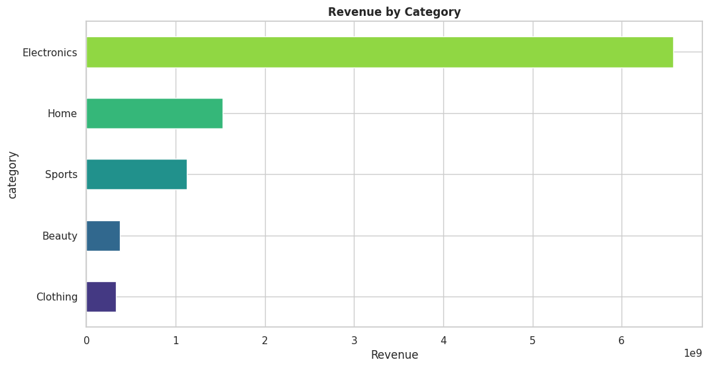
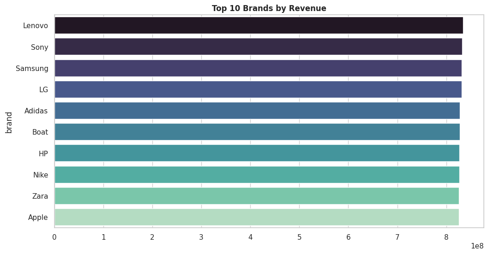
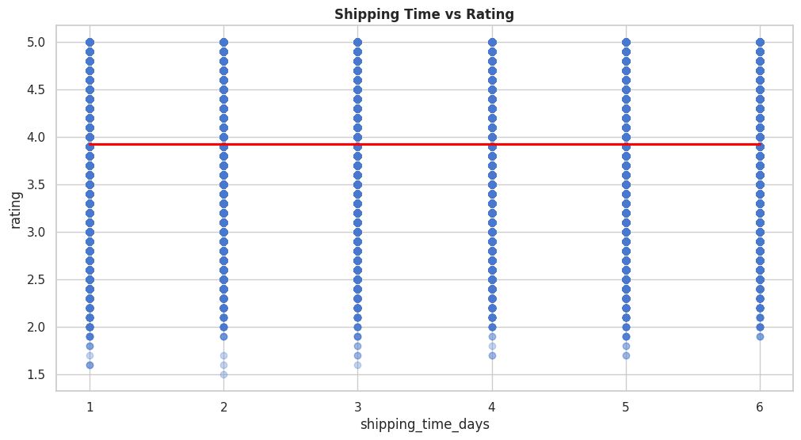
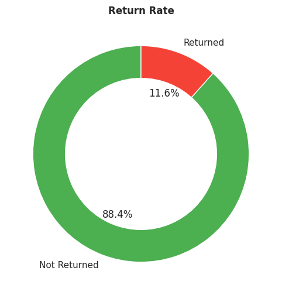
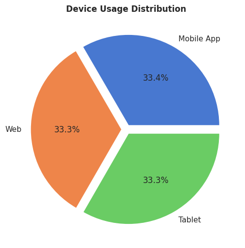
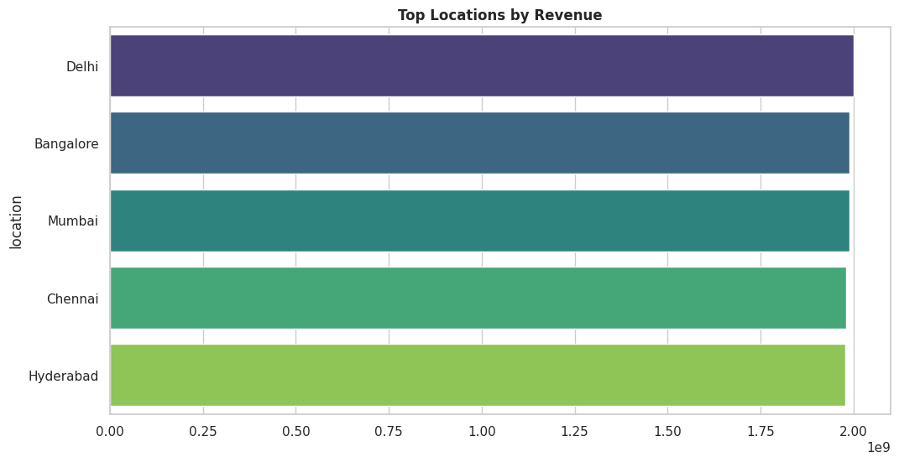
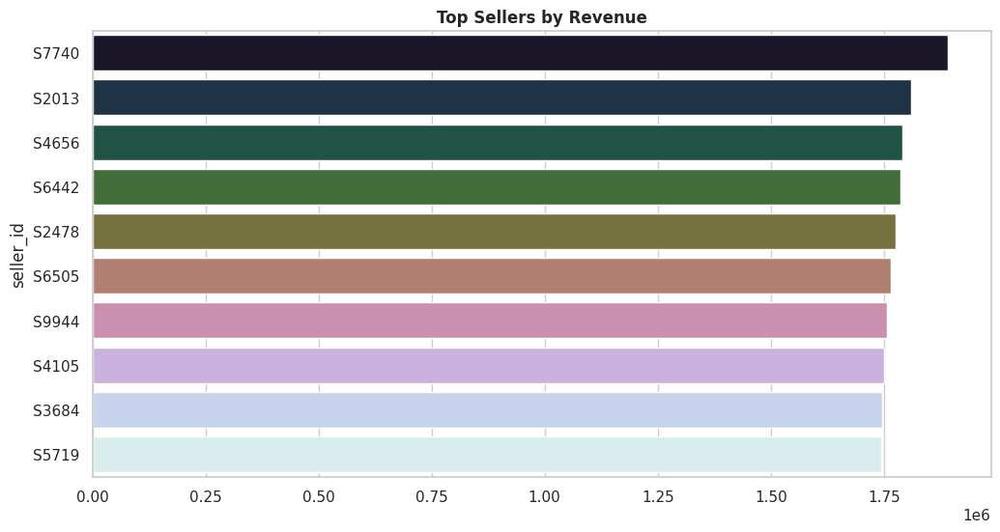
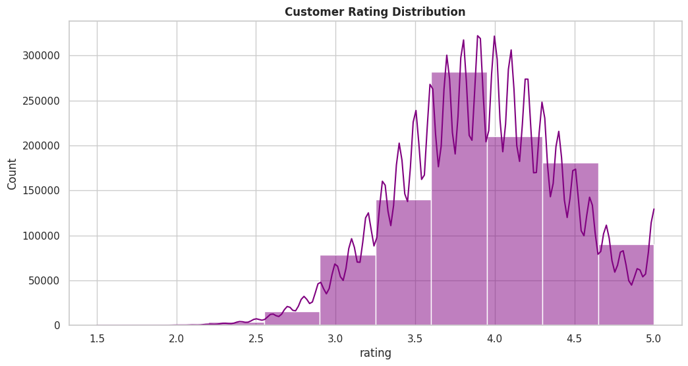
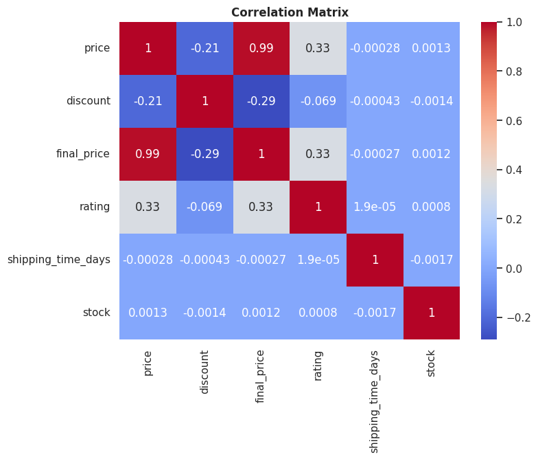

# Amazon E-Commerce Data Analysis

## Overview

This project analyzes Amazon e-commerce transaction data to uncover insights related to revenue, customer behavior, pricing strategies, shipping performance, and seller effectiveness.

The goal is to demonstrate practical data analysis and visualization skills using Python without applying machine learning models.

---

## Project Preview

## Visualizations

### Revenue by Category

### Top Brands by Revenue

### Shipping Time vs Rating

### Return Rate Analysis

### Payment Method Usage

### Device Usage Distribution

### Revenue by Location

### Seller Performance Analysis

### Customer Rating Distribution

### Correlation Matrix

---

## Objectives

- Identify key revenue drivers
- Analyze customer purchasing behavior
- Evaluate the impact of discounts on pricing
- Examine shipping performance and customer satisfaction
- Compare category, brand, seller, and regional performance
- Understand return and delivery patterns

---

## Dataset

Dataset: Amazon E-Commerce Dataset

The dataset contains transaction-level information including:

- Product and category details
- Pricing and discounts
- Customer ratings and reviews
- Shipping and delivery information
- Seller performance metrics
- Device and payment method data

Downloaded directly using KaggleHub.

---

## Tools Used

- Python
- Pandas
- NumPy
- Matplotlib
- Seaborn
- Plotly
- KaggleHub

---

## Key KPIs

- Total Revenue
- Total Orders
- Unique Customers
- Unique Products
- Average Rating
- Return Rate
- Average Shipping Time
- Average Discount

---

## Analysis Workflow

1. Data Loading and Inspection
2. Data Cleaning and Preprocessing
3. Exploratory Data Analysis (EDA)
4. KPI Calculation
5. Business-Focused Visualizations
6. Insight Generation and Recommendations

---

## Visualizations

- Revenue by Category
- Top 10 Subcategories by Revenue
- Top Brands by Revenue
- Price vs Final Price
- Discount vs Rating
- Shipping Time vs Rating
- Return Rate Analysis
- Payment Method Usage
- Device Usage Distribution
- Revenue by Location
- Seller Performance Analysis
- Rating Distribution
- Shipping Time Distribution
- Category vs Rating
- Correlation Heatmap

---

## Key Insights

- Revenue is concentrated among a small number of categories and brands.
- Discounts strongly influence final selling prices.
- Faster shipping is generally associated with higher customer ratings.
- Customer behavior varies across devices and payment methods.
- Regional and seller performance differences reveal growth opportunities.
- Return patterns highlight areas for operational improvement.

---

## Recommendations

- Optimize discount strategies to protect margins.
- Improve shipping efficiency to increase customer satisfaction.
- Focus marketing efforts on top-performing categories and brands.
- Monitor high-return products and investigate root causes.
- Expand efforts in high-performing regions and sellers.

---

## Project Outcome

This project demonstrates end-to-end data analysis skills, including data cleaning, KPI development, exploratory analysis, business storytelling, and professional data visualization using Python.
